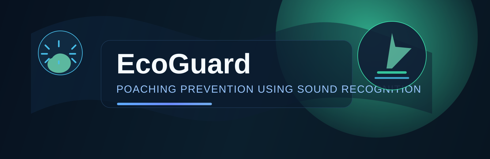
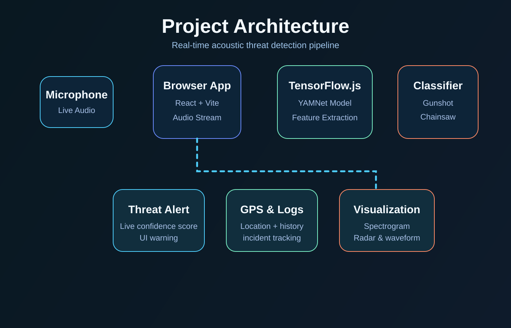

# EcoGuard: Poaching Prevention Using Sound Recognition



A real-time sound classification web app designed to detect suspicious acoustic events such as gunshots and chainsaw activity in protected areas. The app listens to live microphone input, analyzes the audio stream in-browser, and highlights potential threats with confidence scores, live spectrogram visualization, geolocation, and incident history.

## Project Architecture



## Overview

EcoGuard is a Vite + React application that uses TensorFlow.js and the YAMNet audio model to classify environmental sounds. It is tailored for field monitoring and anti-poaching use cases where wildlife protection teams need quick detection of illegal activity.

## Key Features

- Real-time microphone monitoring
- Gunshot and chainsaw detection using TensorFlow.js
- Confidence threshold tuning via sensitivity control
- Audio spectrogram visualization
- Threat alert UI with live confidence display
- GPS tracking and incident logging
- Local incident history stored in browser storage
- Training panel for managing sound prototypes
- Dark/light theme support

## Tech Stack

- React
- TypeScript
- Vite
- Tailwind CSS
- TensorFlow.js
- Lucide React
- Recharts

## Project Structure

```text
.
├── public/
│   └── dataset/
│       └── manifest.json
├── src/
│   ├── App.tsx
│   ├── components/
│   ├── context/
│   ├── data/
│   ├── hooks/
│   ├── main.tsx
│   └── types/
├── config/
├── index.html
├── package.json
├── vite.config.ts
├── tailwind.config.js
├── postcss.config.js
├── eslint.config.js
├── .gitignore
└── README.md
```

## Prerequisites

Before running the project, make sure you have:

- Node.js 18 or newer
- npm
- A browser with microphone access enabled

## Installation

```bash
npm install
```

## Run Locally

```bash
npm run dev
```

Then open the local URL shown in the terminal, usually:

```text
http://localhost:5173
```

## Production Build

```bash
npm run build
```

To preview the production build locally:

```bash
npm run preview
```

## Deployment on Vercel

This project is a Vite frontend and can be deployed directly on Vercel.

Recommended Vercel settings:

- Framework Preset: Vite
- Root Directory: .
- Build Command: `npm run build`
- Output Directory: `dist`
- Install Command: `npm install`

### Steps

1. Push the repository to GitHub.
2. Log in to Vercel.
3. Click "Add New Project".
4. Import the GitHub repository.
5. Use the settings above.
6. Deploy.

## Environment Variables

This project currently does not require any custom environment variables for standard local development or Vercel deployment.

## Notes

- The app uses browser microphone access, so it must be opened in a secure environment or localhost.
- Detection is model-driven and depends on the quality of live audio input and the selected sensitivity threshold.
- This project is intended as a front-end monitoring prototype for anti-poaching sound detection.

## License

This project does not currently include a license file. If you plan to publish it publicly, consider adding an appropriate open-source license.

## Author

Developed as a poaching prevention and wildlife protection monitoring prototype using sound recognition and browser-based AI inference.
